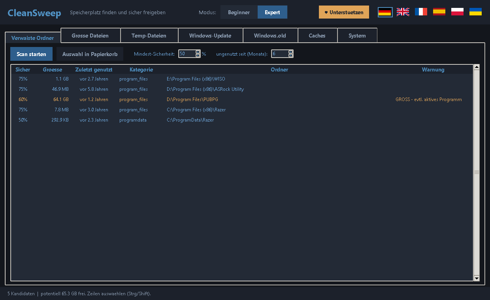

# CleanSweep 🧹

**Kostenloses Windows-Tool zum Freigeben von Speicherplatz.** CleanSweep findet
verwaiste Programm-Reste, große ungenutzte Dateien, Temp- und Cache-Dateien,
Windows-Update-Reste und mehr – und entfernt sie **sicher** (in den Papierkorb,
umkehrbar). Mit Dark Mode, sechs Sprachen und einem Beginner-/Expert-Modus.



## Funktionen

- 🔍 **Verwaiste Programm-Ordner** finden (Reste unsauberer Deinstallationen)
- 📁 **Große, lange ungenutzte Dateien** aufspüren (Filter: seit X Monaten ungenutzt)
- 🧽 **Temp-Dateien, App-/Browser-Caches, Windows-Update-Cache, `Windows.old`**
- 🪟 **WinSxS-Komponentenspeicher** (DISM), **Papierkorb leeren**, **Ruhezustand** abschalten
- ♻️ **Sicheres Löschen** in den Papierkorb + Schutzlisten für System-Ordner
- 🌍 **6 Sprachen** (DE · EN · FR · ES · PL · UK), Dark Mode, Beginner/Expert
- 💾 **Installer** (ohne Python-Installation nötig)

## Was wird gelöscht – und was nicht

CleanSweep ist auf **Sicherheit** ausgelegt:

- **Du entscheidest immer.** Es wird nichts ohne deine Auswahl + Bestätigung gelöscht.
- **Verwaiste Ordner & große Dateien** wandern in den **Papierkorb** – jederzeit
  wiederherstellbar.
- **Temp-/Cache-/Update-Reste** werden endgültig gelöscht (es sind Wegwerf-Daten,
  die Windows/Apps neu anlegen) – nur so wird der Platz wirklich frei.
- **System-Ordner sind geschützt** (mehrere Schutzlisten) und werden selbst dann
  nicht gelöscht, wenn man sie versehentlich auswählt.
- **Aktiv genutzte Programme** werden anhand des „zuletzt genutzt"-Datums erkannt
  und nicht vorgeschlagen.

## Idee

Windows merkt sich jedes sauber installierte Programm in der Registry. Wenn ein
Programm *unsauber* deinstalliert wird, bleiben oft Ordner zurück, ohne dass es
noch einen Registry-Eintrag gibt. Diese "verwaisten" Ordner belegen Platz.

CleanSweep:
1. liest alle installierten Programme aus der Registry,
2. scannt auf **allen festen Laufwerken** die typischen Programm-Orte inkl. Größe,
3. zeigt Ordner an, zu denen **kein** installiertes Programm passt.

### Gescannte Orte (pro festem Laufwerk C:, D:, E: …)

- `Program Files` und `Program Files (x86)`
- die **obersten Ordner** des Laufwerks (portable Apps, Spiele)
- `%LOCALAPPDATA%\Programs`, `%LOCALAPPDATA%`, `%APPDATA%`, `%PROGRAMDATA%`

## ⚠️ Bekannte Grenzen (wichtig zu verstehen!)

CleanSweep kennt nur, was in der **Registry** steht. Daraus folgt:

- **Steam-/Epic-/Xbox-Spiele und portable Apps** stehen oft *nicht* in der
  Registry → sie wirken fälschlich "verwaist". Schutz dagegen: große Ordner
  (> 1 GB / > 5 GB) bekommen einen stark gesenkten Score, weil echte Reste
  fast immer klein sind.
- **Niedrige Sicherheit ≠ löschbar.** Ein Treffer ist immer nur ein *Vorschlag
  zum Prüfen*, nie eine Gewissheit.

## Aufbau (Module)

| Datei | Aufgabe |
|-------|---------|
| `src/registry_scan.py` | Liest installierte Programme aus der Registry |
| `src/folder_scan.py`   | Scannt Programm-Ordner und berechnet Größen |
| `src/orphan_finder.py` | Gleicht beides ab, findet verwaiste Ordner + Score |
| `src/cleaner.py`       | Löschen in den Papierkorb + Sicherheitsprüfungen |
| `src/temp_cleaner.py`  | Temp-Dateien finden + endgültig leeren |
| `src/big_files.py`     | Größte Einzeldateien auf allen Platten finden |
| `src/update_cleaner.py`| Windows-Update-Cache finden + leeren (Admin) |
| `src/windows_old.py`   | Windows.old erkennen + Datenträgerbereinigung starten |
| `src/cache_cleaner.py` | App-/Browser-Caches finden + leeren |
| `src/recycle_bin.py`   | Papierkorb-Größe abfragen + leeren (Windows-API) |
| `src/hibernation.py`   | Ruhezustand-Status + ab-/anschalten (powercfg) |
| `src/dism_cleanup.py`  | WinSxS-Komponentenspeicher per DISM bereinigen |
| `src/i18n.py`          | Übersetzungen (Deutsch/Englisch) für die GUI |
| `src/main.py`          | Konsolen-Startpunkt: Bericht **oder** Lösch-Modus |
| `src/gui.py`           | Grafische Oberfläche (Dark Mode, marineblau, 3 Tabs) |

## Benutzung

### Grafische Oberfläche (am einfachsten)

Doppelklick auf **`CleanSweep starten.bat`** — oder:
```powershell
& "$env:LocalAppData\Programs\Python\Python312\pythonw.exe" src\gui.py
```
Dark-Mode-Fenster mit marineblauer Schrift und **drei Tabs**:
- **Verwaiste Ordner** — Programm-Reste finden → *Auswahl in Papierkorb*
- **Temp-Dateien** — temporäre Dateien anzeigen + endgültig leeren
  (gibt echten Platz frei; gesperrte Dateien werden übersprungen)
- **Große Dateien** — die größten Einzeldateien aller Platten → Papierkorb
- **Windows-Update** — heruntergeladene Update-Pakete leeren (braucht Admin;
  der Tab bietet „Als Administrator neu starten" an)
- **Windows.old** — Reste eines Windows-Upgrades (oft 20–120 GB!) über die
  Windows-Datenträgerbereinigung sicher entfernen
- **Caches** — App-/Browser-Caches (Chrome, Edge, Firefox, Discord, Spotify,
  Teams, Slack, NVIDIA/DirectX-Shader) endgültig leeren
- **System** — Papierkorb leeren (Platz wird erst dann frei) und Ruhezustand
  abschalten (`hiberfil.sys`, gibt RAM-Größe frei; braucht Admin)

Auswahl mit Strg/Shift. Warnungen (z. B. „kürzlich genutzt") erscheinen in Amber.
„Zuletzt genutzt" hilft einzuschätzen, ob etwas noch gebraucht wird.

In **Verwaiste Ordner** und **Große Dateien** gibt es das Feld
*„ungenutzt seit (Monate)"* (Vorgabe **6**): es werden nur Einträge angezeigt,
die seit so vielen Monaten nicht mehr verändert wurden. 0 = kein Filter.

**Rechtsklick** auf eine Tabellenzeile → *„Springe in den Ordner"* öffnet den
Pfad im Explorer (Doppelklick geht auch). Bei Dateien wird die Datei markiert.

**Sprache:** Oben rechts über die kleinen Flaggen umschaltbar — Deutsch,
Englisch, Französisch, Spanisch, Polnisch, Ukrainisch (🇩🇪 🇬🇧 🇫🇷 🇪🇸 🇵🇱 🇺🇦).
Deutsch ist Standard. Alle Übersetzungen liegen in `src/i18n.py`.

**Beginner/Expert:** Oben mittig. Standard ist **Beginner** (zeigt nur die
einfachen, sicheren Funktionen). **Expert** gibt zusätzlich die zwei
fortgeschrittenen Reiter *Verwaiste Ordner* und *Große Dateien* frei.

### Konsole

```powershell
# Python-Pfad (bei dieser Installation):
$py = "$env:LocalAppData\Programs\Python\Python312\python.exe"

# Analyse starten
& $py src\main.py

# Nur sehr sichere Kandidaten + CSV-Export
& $py src\main.py --min-confidence 70 --csv bericht.csv

# LÖSCH-Modus (interaktiv, Papierkorb, mit Bestätigung)
& $py src\main.py --delete
```

### Lösch-Modus

`--delete` zeigt die Kandidaten nummeriert an und fragt dann:
1. **Auswahl**: `1 3 5` oder `1-4` oder `alle` (leer = abbrechen)
2. **Vorschau**: zeigt genau, was verschoben wird + Speicher-Gewinn
3. **Bestätigung**: erst nach Eingabe von `LOESCHEN` wird verschoben

Alles geht in den **Papierkorb** und kann von dort wiederhergestellt werden.
Jede Löschung wird in `cleansweep_loeschungen.log` protokolliert.

Benötigt das Paket `Send2Trash`:
```powershell
& $py -m pip install Send2Trash
```

Jedes Modul kann man auch einzeln zum Testen starten, z. B.:
```powershell
& $py src\registry_scan.py   # zeigt nur installierte Programme
& $py src\folder_scan.py     # zeigt nur Ordner + Größen
```

## Installer (Setup.exe)

Es gibt eine fertige **`installer\out\CleanSweep-Setup.exe`**, die CleanSweep
ohne Python installiert. Sie zeigt beim Start einen **Sprachauswahl-Dialog**
(dieselben 6 Sprachen), installiert ins Benutzerprofil (ohne Admin), legt
Verknüpfungen an und merkt sich die gewählte Sprache, sodass die App gleich
darin startet.

### Selbst neu bauen

Voraussetzungen: PyInstaller (`pip install pyinstaller`) und
[Inno Setup 6](https://jrsoftware.org/isinfo.php). Dann:

```powershell
powershell -ExecutionPolicy Bypass -File installer\build.ps1
```

Ablauf: erst wird das Icon erzeugt (`installer\make_icon.py` → `cleansweep.ico`),
dann packt PyInstaller `src\gui.py` zu `installer\dist\CleanSweep.exe` (mit
eingebettetem Icon), danach kompiliert Inno Setup (`installer\CleanSweep.iss`)
die fertige `installer\out\CleanSweep-Setup.exe`.

### Icon

App, Fenster und Installer nutzen ein eigenes Besen-Icon (Marine/Amber),
erzeugt von [make_icon.py](installer/make_icon.py) mit Pillow. Zum Ändern das
Skript anpassen und neu bauen.

### Code-Signing (vorbereitet)

Das Programm ist **fürs Signieren vorbereitet**: ohne Zertifikat baut alles
normal (nur ohne Signatur), mit Zertifikat werden **App-exe und Installer
automatisch signiert** (das beseitigt nach und nach die SmartScreen-Warnung).

Sobald das Zertifikat da ist, sind nur **zwei Schritte** nötig:

1. **`signtool.exe` bereitstellen** (einmalig) — Teil des Windows SDK:
   ```powershell
   winget install --id Microsoft.WindowsSDK.10 -e --source winget
   ```
2. **Zertifikatsdaten oben in [build.ps1](installer/build.ps1) eintragen**, je
   nach Zertifikatstyp:
   - `.pfx`-Datei → `$SignMode = "pfx"`, `$SignCert = "Pfad.pfx"`, `$SignPassword = "..."`
   - Hardware-Token / EV (Zertifikatsspeicher) → `$SignMode = "thumbprint"`,
     `$SignCert = "<SHA1-Fingerabdruck>"`
   - Auswahl per Name → `$SignMode = "subject"`, `$SignCert = "Name"`

Danach normal bauen — `build.ps1` signiert beide Dateien mit Zeitstempel
(`/tr`, damit die Signatur auch nach Ablauf des Zertifikats gültig bleibt).

## Sicherheitskonzept (wichtig!)

- **Schutzliste** (`PROTECTED_NAMES`) für System-Ordner — diese werden nie als
  Rest gemeldet. (Inkl. lokalisierter Namen wie "Gemeinsame Dateien"!)
- **Sicherheits-Score (0–100 %)** statt blindem "verwaist = weg".
- Phase 1 löscht grundsätzlich nichts.

## Geplante nächste Schritte

- [x] Alle festen Laufwerke + mehr Quellen (AppData, ProgramData) scannen
- [x] Größen-Heuristik gegen False Positives (Spiele etc.)
- [x] **Phase 2:** Löschen — nur in den **Papierkorb** (umkehrbar),
      mit Auswahl, Vorschau und Bestätigung + unabhängiger Sicherheitsprüfung
- [ ] Startmenü-Verknüpfungen prüfen (defekte Verknüpfungen = starkes Indiz)
- [ ] Steam-/Epic-Bibliotheken erkennen und ausnehmen
- [x] Grafische Oberfläche (Dark Mode, marineblaue Schrift, Tabs)
- [x] „Zuletzt genutzt"-Signal (kürzlich genutzte Ordner werden geschont)
- [x] Temp-Dateien-Bereinigung
- [x] Größte-Dateien-Finder
- [x] Windows-Update-Cache leeren (SoftwareDistribution\Download, mit Admin)
- [x] `Windows.old` entfernen (über Datenträgerbereinigung)
- [x] Rechtsklick / Doppelklick: „Springe in den Ordner" (Explorer)
- [x] Alters-Filter „ungenutzt seit (Monate)" (Vorgabe 6)
- [x] App-/Browser-Caches leeren
- [x] Papierkorb anzeigen + leeren
- [x] Ruhezustand abschalten (hiberfil.sys)
- [x] DISM-Komponentenbereinigung (WinSxS) im Windows-Update-Tab
- [x] Mehrsprachigkeit (DE/EN/FR/ES/PL/UK) per Flaggen oben rechts
- [x] Beginner/Expert-Umschalter (Expert gibt Verwaiste Ordner + Große Dateien frei)
- [x] Installer (Setup.exe) mit Sprachauswahl, ohne Python; Sprache wird übernommen
- [x] Eigenes Icon (Besen) für App, Fenster und Installer
- [x] Spenden-Knopf (PayPal) im Kopfbereich, in allen Sprachen
- [ ] Whitelist für eigene Daten-Ordner (z.B. Aufnahmen)
- [ ] Doppelte Dateien finden

> Hinweis: Delivery-Optimization-Cache, Absturz-Dumps und Windows-Update-Cleanup
> sind über den `cleanmgr`-Knopf (Tab Windows.old) abgedeckt — kein eigenes Modul nötig.
